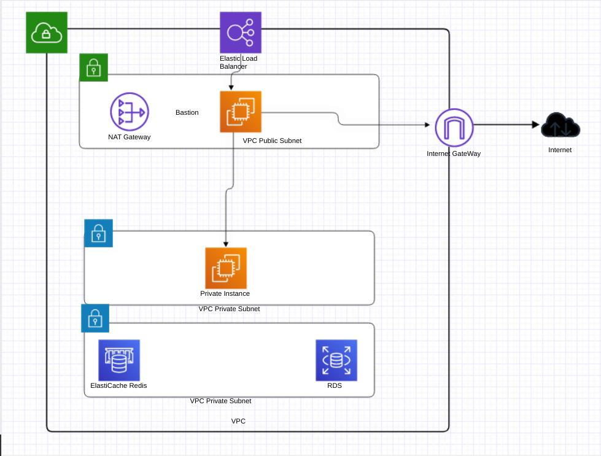

# Jenkins Pipeline

## Tools Used

<p align="center">
<a href="https://www.terraform.io/" target="_blank" rel="noreferrer">  </a> <a href="https://www.ansible.com/" target="_blank" rel="noreferrer">  </a>  <a href="https://aws.amazon.com" target="_blank" rel="noreferrer">  </a> <a width="40" height="40"/> </a> <a href="https://www.docker.com/" target="_blank" rel="noreferrer">  </a> <a href="https://www.jenkins.io" target="_blank" rel="noreferrer">  </a> 
</p>
In this project we will:

* Bulid infrastructure on [AWS](https://aws.amazon.com/) using [Terraform](https://www.terraform.io/)
* Configure the environment using [Ansible](https://www.ansible.com/)
* Build simple node.js app using [Docker](https://www.docker.com/)
* Integrate all these tools with each other and build a pipelines using [Jenkins](https://www.jenkins.io/) to setup infrastructure and deploy our app
## Project infrastructure


## Preparing Jenkins master:
* Clone The repo:
```sh
git clone git@github.com:4mohamedalaa/Jenkins_pipeline_project.git
```
* Build the Dockerfile 
```sh
docker -f jenkins_dockerfile . -t master-node
```
* Run a docker container:
```sh
docker run -d -it -v /var/run/docker.sock:/var/run/docker.sock -v jenkins-data:/var/jenkins_home  -p 8081:8080 master_node
```