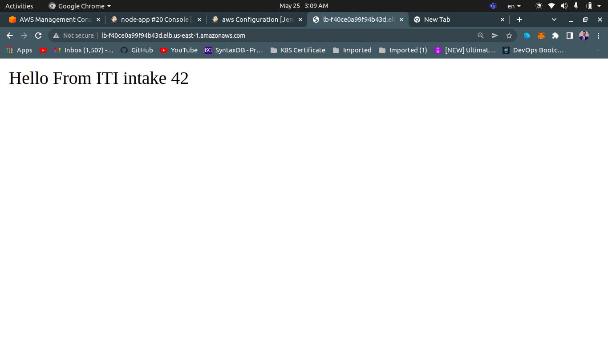

# Jenkins Pipeline

## Tools Used

       

In this project we will:

* Bulid infrastructure on [AWS](https://aws.amazon.com/) using [Terraform](https://www.terraform.io/)
* Configure the environment using [Ansible](https://www.ansible.com/)
* Build simple node.js app using [Docker](https://www.docker.com/)
* Integrate all these tools with each other and build a pipelines using [Jenkins](https://www.jenkins.io/) to setup infrastructure and deploy our app
## Project infrastructure

## Jenkins Configurations

### Plugins used 
* `Pipeline: AWS Steps` to add aws iam user creditionals 
* `Terraform` so jenkins can use terraform 
* `Ansible` so jenkins can use ansible 
## Pipelines 
* ## infrastructure pipeline:
     * that build the infrastructure on aws from this repo 
     
     * then ansible will configure the the private intance to  be ready as jenkins slave 
     by installing `open-jdk` and copy `agent.jar` file to it

     * config file is created by script in `jenkinsfile` 

     * the config file that created and `ansbile` use to reach the 
     private instance from bastion host: 
     
    
    ### then from jenkins console connect the private instance like this:
    
    ### now its connected and ready to host deployments
    
* ## Node-app Deployment pipeline

    * jenkins deploy the app from this [forked repo](git@github.com:4mohamedalaa/jenkins_nodejs_example.git) 

    * the app need Enviroment variables and their values are created by `terraform` then copied to the private instance using `ansible`

    * this pipeline is triggered by the completeion of the `infrastructure pipeline`
## The result of this project 
* the application up and running 

* mysql database connected

*redis connection

